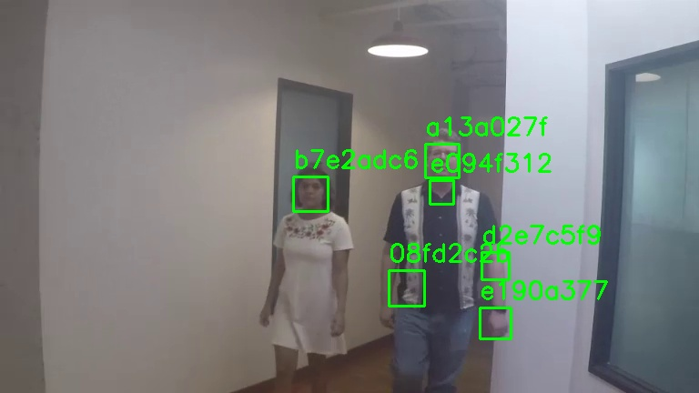
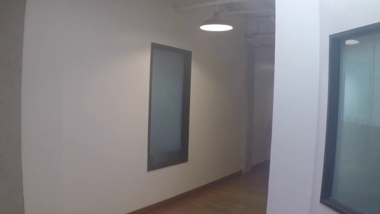

# AI Video Redaction Service (MediaPipe Detector Branch)

This branch contains a version of the `detector-service` that uses the **MediaPipe Face Detector**. This component is a stateless, container-ready Python application designed to perform face detection on video files and output structured metadata.

**Note:** This implementation has known limitations and is preserved for archival and comparison purposes. For a more accurate and robust solution, please refer to the main branch, which will feature a YOLO-based detector.

## How it Works

The application processes a video file frame by frame, using the MediaPipe `FaceDetector` to identify faces. For each detected face, it records the frame number, a unique tracking ID, and the bounding box coordinates.

To improve the detection of small faces, this implementation uses a **tiling strategy**. Each frame is broken down into smaller, overlapping tiles, and detection is run on each tile. The results are then merged using Non-Maximum Suppression.

## Known Limitations

The MediaPipe Face Detector, even with the tiling strategy, has significant limitations in detecting faces that are:

*   **Small or distant** from the camera.
*   **Partially occluded** (e.g., covered by a hand or object).
*   **In poor lighting** or unusual angles.

This can result in both missed faces (false negatives) and incorrect detections of other objects as faces (false positives).

### Examples of Poor Detection

The following images from the test video demonstrate the limitations of this model. Notice the incorrect detection of a neck/chin as a separate face.

**Image: `frame_0263.jpg`**


**Image: `frame_0200.jpg`**


## Running Locally

To run the `detector-service` locally, follow these steps:

1.  **Install Dependencies:**
    ```bash
    pip install -r requirements.txt
    ```

2.  **Run the Service:**
    ```bash
    bash run_local.sh
    ```

This will process the sample video in the `tests` directory and output the following to the `output` directory:

*   `metadata.parquet`: A Parquet file containing the structured metadata for all detected faces.
*   `thumbnails/`: A directory containing a thumbnail image for each unique face detected.

You can adjust the sensitivity of the detector by editing the `MIN_DETECTION_CONFIDENCE` environment variable in the `run_local.sh` script.

## Project Structure

```
.
├── Dockerfile
├── README.md
├── requirements.txt
├── run_local.sh
├── src
│   └── process.py
└── tests
    └── sample_video.mp4
